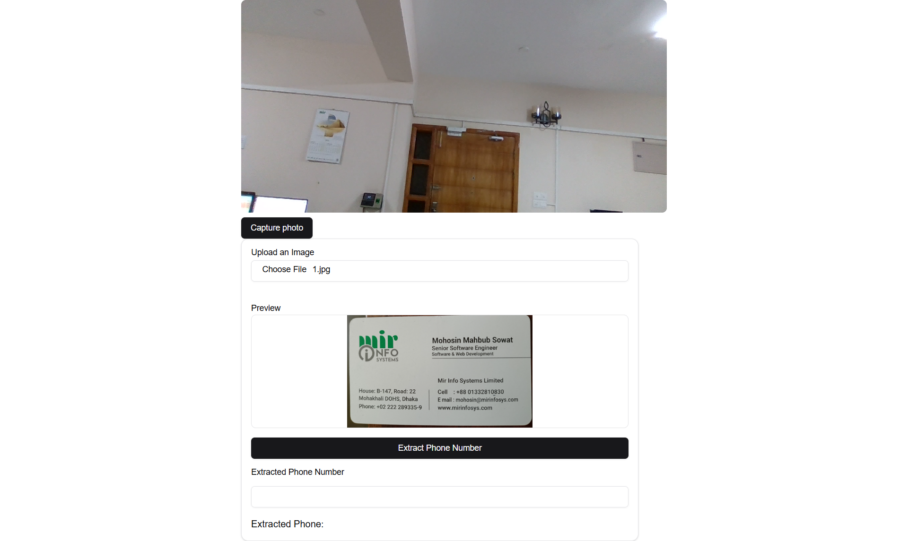

# Image to contact no converter

This project on creating a basic website with features such as taking image from webcam or upload from your local device and showing only the contact number from it.

## Features Implemented

1.  **Capture the image via webcam**

- Users can capture the image via webcam.

2.  **Upload the image**

- Users can upload the image from their own local device storage.

3.  **Grabbing the number**

- Upon clicking on the "Extract phone Number" button, it scans the image and extracts the phone number from it.

## Screenshots




## Tech Stack

- **Frontend**: Next.js, Tessasract.js, React-webcam, Tailwind CSS , ShadCn Component

## How to Run the Project

1. Clone this repository:

   ```bash
   git clone <repository-link>
   ```

2. Navigate to the project directory:

   ```bash
   cd project-directory
   ```

3. Install dependencies for the frontend:

   ```bash
   npm install
   ```

   ```
   npx shadcn@latest add card
   ```

   ```
   npx shadcn@latest add button
   ```

   ```
   npx shadcn@latest add input
   ```

   ```
   npx shadcn@latest add label
   ```

4. Start the frontend development server:

   ```bash
   npm run dev
   ```

5. Open the application in your browser at `http://localhost:3000`.

6. Provide browser the permission to use the webcam.
